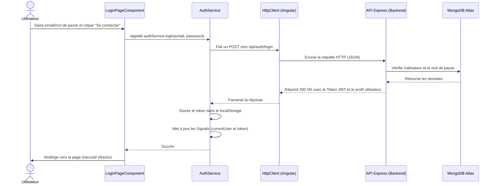

# Rapport d'usage de l'IA - TP1

Pour chaque mission, détailler et fournir des explications concernant : objectif; prompt principal; plan proposé par l'agent; vérifications réalisées par le binôme; erreurs ou propositions rejetées; fichiers effectivement modifiés; preuve de fonctionnement; ce que chaque membre sait maintenant expliquer sans l'agent.

## TP1

### Mission 0 : Cartographier l'application

*   **Objectif** : Retrouver les éléments clés de l'application (composant racine, routes, HttpClient, mécanisme JWT) et comprendre le flux de connexion.
*   **Prompt principal** : "Analyse moi tout le projet et dit moi tout ce que je dois savoir le plus important... puis commençons tout de suite par cartographier l'application (Mission 0)".
*   **Plan proposé par l'agent** : L'agent a fouillé les dossiers `src/` pour identifier `main.ts`, le fichier des routes, et l'intercepteur. Il a ensuite généré un diagramme de séquence complet et séparé les routes publiques des routes protégées en lisant `API_CONTRACT.md`.
*   **Vérifications réalisées par le binôme** : Nous avons vérifié nous-mêmes dans le code (`main.ts` et `auth.interceptor.ts`) que l'enregistrement du HttpClient et l'interception du token correspondaient bien à l'explication de l'agent.
*   **Erreurs ou propositions rejetées** : Aucune pour cette mission de lecture.
*   **Fichiers effectivement modifiés** : Aucun fichier de code n'a été modifié, uniquement l'analyse du projet.
*   **Preuve de fonctionnement** : Schéma du flux de connexion généré :

*   **Ce que chaque membre sait maintenant expliquer** : Nous savons où se trouve l'amorçage de l'app (`main.ts`), comment les requêtes ajoutent automatiquement le token grâce à l'intercepteur, et la différence entre les routes API protégées ou non.

### Mission 1 : Inscription, Connexion et Profil

*   **Objectif** : Implémenter les formulaires de connexion et d'inscription avec validation, gérer la page de profil pour afficher les données de l'utilisateur automatiquement, sécuriser la navigation avec la déconnexion et attraper les erreurs 401 pour rediriger vers la page de login.
*   **Prompt principal** : "Oui c'est parti, j'aimerai par ailleurs si possible que tu notes tout ce que tu fais comme ajout, modif et suppression...".
*   **Plan proposé par l'agent** : Analyser les composants existants (une grande partie du TS étant déjà prête). Ajouter les messages d'erreur HTML pour la connexion et l'inscription. Ajouter le bouton de déconnexion et conditionner l'affichage du menu dans `app.html` et `app.ts`. Implémenter l'interface `OnInit` dans `profile-page.ts` pour charger le profil automatiquement. Mettre à jour `auth.interceptor.ts` pour intercepter les requêtes HTTP renvoyant une erreur 401 et rediriger l'utilisateur vers `/login`.
*   **Vérifications réalisées par le binôme** : Nous avons suivi le code généré, regardé le fonctionnement dans l'application (`localhost:4200`) et vérifié le bon comportement des règles de l'interface (comme les messages d'erreur du formulaire et la disparition du menu une fois déconnecté).
*   **Erreurs ou propositions rejetées** : Aucune erreur. Le code de base fournissait déjà une bonne architecture pour le JWT dans le Service.
*   **Fichiers effectivement modifiés** : 
    - `login-page.html` & `register-page.html` (Validation form).
    - `app.ts` & `app.html` (Bouton déconnexion, masquage des onglets).
    - `profile-page.ts` & `profile-page.html` (Auto-chargement du profil avec `OnInit`).
    - `auth.interceptor.ts` (Gestion des 401 et redirection via Router).
*   **Preuve de fonctionnement** : [À FAIRE : AJOUTER ICI LA CAPTURE D'ÉCRAN DE L'ONGLET NETWORK LORS DE LA CONNEXION / PROFIL]
*   **Ce que chaque membre sait maintenant expliquer** : Comment afficher dynamiquement un message d'erreur d'un formulaire réactif (`form.controls.email.invalid`), comment utiliser le cycle de vie `OnInit` pour charger des données à l'ouverture d'un composant, et à quoi sert l'opérateur `catchError` dans un Interceptor Angular.