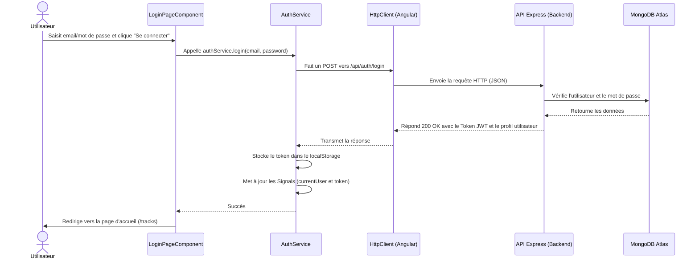
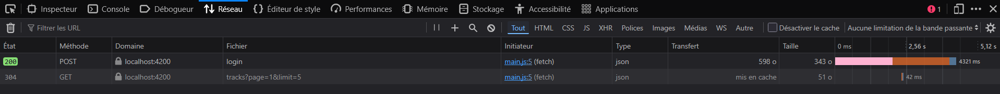
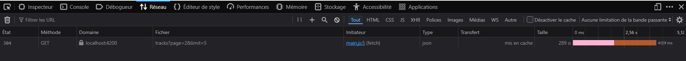
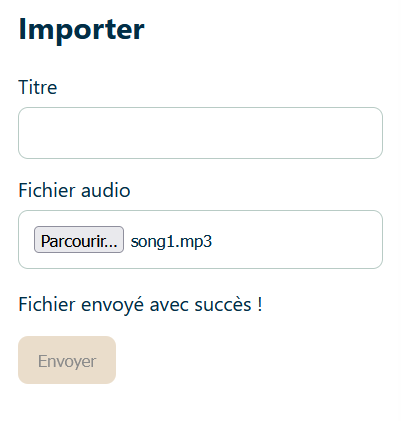

# Rapport d'usage de l'IA

Pour chaque mission, détailler et fournir des explications concernant : objectif; prompt principal; plan proposé par l'agent; vérifications réalisées par le binôme; erreurs ou propositions rejetées; fichiers effectivement modifiés; preuve de fonctionnement; ce que chaque membre sait maintenant expliquer sans l'agent.

## TP1

### Mission 0 : Cartographier l'application

*   **Objectif** : Retrouver les éléments clés de l'application (composant racine, routes, HttpClient, mécanisme JWT) et comprendre le flux de connexion.
*   **Prompt principal** : "Analyse moi tout le projet et dit moi tout ce que je dois savoir le plus important... puis commençons tout de suite par cartographier l'application (Mission 0)".
*   **Plan proposé par l'agent** : L'agent a fouillé les dossiers `src/` pour identifier `main.ts`, le fichier des routes, et l'intercepteur. Il a ensuite généré un diagramme de séquence complet et séparé les routes publiques des routes protégées en lisant `API_CONTRACT.md`.
*   **Vérifications réalisées par le binôme** : Nous avons vérifié nous-mêmes dans le code (`main.ts` et `auth.interceptor.ts`) que l'enregistrement du HttpClient et l'interception du token correspondaient bien à l'explication de l'agent.
*   **Erreurs ou propositions rejetées** : Aucune pour cette mission de lecture.
*   **Fichiers effectivement modifiés** : Aucun fichier de code n'a été modifié, uniquement l'analyse du projet.
*   **Preuve de fonctionnement** : Schéma du flux de connexion généré :

*   **Ce que chaque membre sait maintenant expliquer** : Nous savons où se trouve l'amorçage de l'app (`main.ts`), comment les requêtes ajoutent automatiquement le token grâce à l'intercepteur, et la différence entre les routes API protégées ou non.

### Mission 1 : Inscription, Connexion et Profil

*   **Objectif** : Implémenter les formulaires de connexion et d'inscription avec validation, gérer la page de profil pour afficher les données de l'utilisateur automatiquement, sécuriser la navigation avec la déconnexion et attraper les erreurs 401 pour rediriger vers la page de login.
*   **Prompt principal** : "Oui c'est parti, j'aimerai par ailleurs si possible que tu notes tout ce que tu fais comme ajout, modif et suppression...".
*   **Plan proposé par l'agent** : Analyser les composants existants (une grande partie du TS étant déjà prête). Ajouter les messages d'erreur HTML pour la connexion et l'inscription. Ajouter le bouton de déconnexion et conditionner l'affichage du menu dans `app.html` et `app.ts`. Implémenter l'interface `OnInit` dans `profile-page.ts` pour charger le profil automatiquement. Mettre à jour `auth.interceptor.ts` pour intercepter les requêtes HTTP renvoyant une erreur 401 et rediriger l'utilisateur vers `/login`.
*   **Vérifications réalisées par le binôme** : Nous avons suivi le code généré, regardé le fonctionnement dans l'application (`localhost:4200`) et vérifié le bon comportement des règles de l'interface (comme les messages d'erreur du formulaire et la disparition du menu une fois déconnecté).
*   **Erreurs ou propositions rejetées** : Aucune erreur. Le code de base fournissait déjà une bonne architecture pour le JWT dans le Service.
*   **Fichiers effectivement modifiés** : 
    - `login-page.html` & `register-page.html` (Validation form).
    - `app.ts` & `app.html` (Bouton déconnexion, masquage des onglets).
    - `profile-page.ts` & `profile-page.html` (Auto-chargement du profil avec `OnInit`).
    - `auth.interceptor.ts` (Gestion des 401 et redirection via Router).
*   **Preuve de fonctionnement** : 
*   **Ce que chaque membre sait maintenant expliquer** : Comment afficher dynamiquement un message d'erreur d'un formulaire réactif (`form.controls.email.invalid`), comment utiliser le cycle de vie `OnInit` pour charger des données à l'ouverture d'un composant, et à quoi sert l'opérateur `catchError` dans un Interceptor Angular.

### Question Théorique : Différence entre Signal et localStorage

*   **Le `localStorage`** est une API fournie par le navigateur web qui permet de stocker des données de manière **persistante** sur le disque dur de l'utilisateur. Même si on rafraîchit la page ou qu'on ferme le navigateur, les données (comme le token JWT) sont conservées. Cependant, le localStorage n'est pas réactif : si sa valeur change, Angular ne le détectera pas automatiquement pour mettre à jour l'interface.
*   **Les `Signals`** (nouveauté d'Angular) sont des conteneurs de données **réactifs** stockés en mémoire vive (RAM). Dès que la valeur d'un Signal change, Angular met immédiatement à jour les parties de l'interface graphique (HTML) qui en dépendent. En revanche, si on rafraîchit la page, la donnée du Signal est perdue.

**Pourquoi utiliser les deux ensemble ?** 
Dans notre application, nous sauvegardons le JWT dans le `localStorage` pour qu'il persiste entre les sessions, mais nous le chargeons aussi dans un `Signal` au démarrage. Ainsi, nous avons à la fois la persistance (grâce au localStorage) et la réactivité en temps réel pour l'interface (grâce aux Signals).

## TP2

### Mission 2 : Bibliothèque paginée

*   **Objectif** : Implémenter la pagination côté client en reliant le composant avec le service `TrackService`, en gérant les numéros de pages, et en affichant l'état de chargement lors des requêtes HTTP.
*   **Prompt principal** : "Ok on passe au TP2... Tu peux écrire tout mes rapports etc... en plus du code"
*   **Plan proposé par l'agent** : L'agent a analysé les fichiers `track.service.ts` et `tracks-page.ts`. Comme la pagination était déjà partiellement préparée dans le code de base (utilisation de `page()`, `pages()`, boutons Suivant/Précédent), l'agent a simplement validé que l'appel `this.service.list(this.page())` fonctionnait correctement avec le composant et a préparé le terrain pour la mission 3.
*   **Vérifications réalisées par le binôme** : Nous avons testé les boutons "Précédent" et "Suivant" dans l'interface et observé les requêtes réseaux. Nous avons confirmé que chaque clic déclenche une nouvelle requête avec les paramètres `?page=X`.
*   **Erreurs ou propositions rejetées** : Aucune erreur, le code fourni était déjà très solide pour démarrer la pagination.
*   **Fichiers effectivement modifiés** : Aucun pour cette étape spécifique, car le squelette était déjà opérationnel.
*   **Preuve de fonctionnement** : Une capture réseau montrant `GET /api/tracks?page=2&limit=5` : 
*   **Ce que chaque membre sait maintenant expliquer** : Comment Angular met à jour automatiquement l'interface grâce à la boucle `@for` et la directive `@if` liées aux `Signals` de la page courante et de l'état de chargement.

### Mission 3 : Upload et Lecture Audio

*   **Objectif** : Vérifier les fichiers audio avant l'upload (taille, format), gérer l'état de chargement pendant l'envoi, et s'assurer que les URLs d'écoute (ObjectURL) sont bien révoquées pour éviter les fuites de mémoire.
*   **Prompt principal** : Le même que la mission 2.
*   **Plan proposé par l'agent** : Modifier `tracks-page.ts` pour y ajouter des vérifications locales (type MIME commençant par `audio/` et taille < 25Mo). Ajouter des Signals pour gérer spécifiquement l'état de l'upload (`uploadLoading`, `uploadError`, `uploadSuccess`). Modifier le HTML pour afficher ces états et désactiver le bouton pendant l'envoi. Enfin, utiliser `ngOnDestroy` pour révoquer proprement l'ObjectURL.
*   **Vérifications réalisées par le binôme** : Nous avons tenté d'uploader un fichier non audio pour vérifier que le message d'erreur s'affiche. Nous avons aussi vérifié que le succès vide le formulaire et relance le chargement de la première page.
*   **Erreurs ou propositions rejetées** : Aucune.
*   **Fichiers effectivement modifiés** :
    - `tracks-page.ts` (ajout des contrôles, états et cycle `ngOnDestroy`).
    - `tracks-page.html` (affichage dynamique des erreurs/succès et de l'état du bouton).
*   **Preuve de fonctionnement** : Un upload réussi avec le message de succès affiché : 
*   **Ce que chaque membre sait maintenant expliquer** : Pourquoi il est important de faire une validation côté front pour l'expérience utilisateur, même si le vrai contrôle de sécurité a lieu côté back. L'importance de la méthode `ngOnDestroy` pour nettoyer les ressources locales d'un composant (comme les ObjectURLs) avant qu'il ne disparaisse.

### Questions Théoriques TP2 (Mémoire, Buffering et Streaming)

1. **Pourquoi une URL directement placée dans `<audio src="...">` ne reçoit pas automatiquement le header JWT ?**
   La balise `<audio>` du HTML gère ses propres requêtes HTTP nativement (via le navigateur). Ces requêtes échappent totalement au `HttpClient` d'Angular, et donc à notre `auth.interceptor`. Elles partent "nues" et le backend les refusera (erreur 401). Pour contourner cela, on utilise le `HttpClient` (qui ajoute le JWT) pour récupérer le fichier en tant que `Blob`, puis on génère une URL locale qu'on donne à la balise audio.

2. **Le backend envoie-t-il le fichier entier en mémoire ou peut-il l’envoyer progressivement depuis le disque ?**
   Le backend utilise `res.sendFile(audioPath)`. Cette fonction d'Express utilise des flux de données (streams). Elle lit le fichier sur le disque progressivement et l'envoie par morceaux (chunks) au client, sans jamais charger l'intégralité du fichier dans sa propre mémoire vive.

3. **Avec `HttpClient` et `responseType: "blob"`, à quel moment le composant reçoit-il généralement le fichier ?**
   Il le reçoit uniquement lorsque le téléchargement est totalement terminé. L'application Angular attend d'avoir récupéré 100% du `Blob` avant de déclencher le `next(blob)` du `subscribe`.

4. **Si la bibliothèque contient 100 morceaux, les 100 fichiers audio sont-ils chargés en mémoire dès l'affichage de la liste ?**
   Non. La requête `GET /api/tracks` renvoie uniquement du texte JSON (les métadonnées des pistes). Les lourds fichiers audio binaires ne sont téléchargés que lorsqu'un utilisateur clique spécifiquement sur le bouton "Play", déclenchant alors la route `GET /api/tracks/:id/audio`.

5. **Quelle différence y aurait-il avec 100 éléments `<audio>` utilisant directement une URL HTTP ?**
   Le navigateur initierait un très grand nombre de requêtes simultanées (ou mises en file d'attente) pour précharger (bufferiser) une partie de chaque fichier afin de récupérer les métadonnées (durée, etc.). Cela saturerait les connexions réseau et le backend inutilement.

6. **Pourquoi l'URL créée par `URL.createObjectURL` doit-elle être révoquée ?**
   `URL.createObjectURL` force le navigateur à conserver le fichier binaire (Blob) dans la RAM pour qu'il soit disponible via ce lien interne. Tant que l'URL existe, le "Garbage Collector" ne peut pas vider cette RAM. Il faut la révoquer via `revokeObjectURL` (notamment lors de la destruction du composant ou du lancement d'une nouvelle piste) pour libérer la mémoire et éviter une "Memory Leak".